# AzureExamify
Experimental

## Django Channels City Overview

### Speech-to-Speech Real-time Communication with LLM via Django Channels

### Journey of a "Hello" Through the Django Channels System

```mermaid
sequenceDiagram
    participant U as 👤 User
    participant B as 🌐 Browser
    participant C as 🎭 Channels
    participant SC as ⚡ Consumer
    participant STT as 🎤 STT
    participant LLM as 🤖 LLM
    participant TTS as 🔊 TTS

    Note over U,TTS: When User Says "Hello"
    U->>B: Speaks "Hello"
    B->>C: Sends audio stream
    C->>SC: Routes to consumer
    SC->>STT: Processes audio
    STT->>SC: Returns "hello" text
    SC->>LLM: Sends message + context

    Note over LLM: Processing...
    LLM->>SC: "Hi! How can I help?"
    
    SC->>TTS: Convert to speech
    TTS->>SC: Audio stream
    SC->>C: WebSocket message
    C->>B: Audio delivery
    B->>U: Plays response

    Note over SC,LLM: Conversation state updates in background
```
